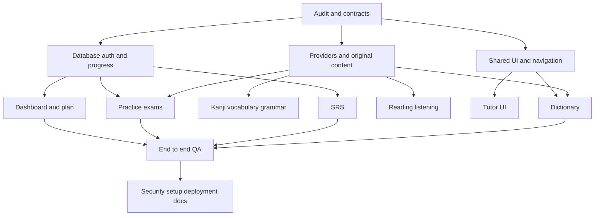

# Implementation plan

Deliver working account → dictionary → saved card → SRS → practice exam → persisted dashboard flow, plus usable learning surfaces for all ten modules. Keep completion claims bounded by test evidence and available content/providers.

## Execution

Requested GPT-5.6 is not an available model override. Use available `gpt-6.1-sol` workers with bounded context, with lead handling architecture/integration. This is a substitution, not a claim that GPT-5.6 ran. No token/cost figures are invented.

T00 is completed first. Parallel workers receive isolated Git worktrees and disjoint files, all based on the committed contracts. Main agent owns root manifests/lockfile, integration, tests and docs. Workers create one validated commit per completed subtask. Integrate via cherry-pick, preserving branch history and no remote pushes.

## UI brief

Vietnamese interface with readable Japanese ruby. Retain Next/Tailwind and theme context. One indigo accent, neutral surfaces, thin borders, 12px cards, system sans with Japanese fallback, visible keyboard focus. Desktop sidebar and compact mobile navigation. Main actions: search, study due cards, continue lesson, practice, view actual progress. All counters come from account data. Every async screen needs loading/empty/error/retry. Browser TTS capabilities are explicitly disclosed. No mock dashboard numbers.

## Verification

Targeted unit tests for adapters, grading and SRS; integration against isolated PostgreSQL for auth, ownership, duplicate submissions, persistence; browser journey at desktop and 375px. Build/lint/typecheck at integration checkpoints. No destructive migrations against existing databases. Production readiness remains conditional on maintained dependencies, provider setup and reviewed content breadth.
